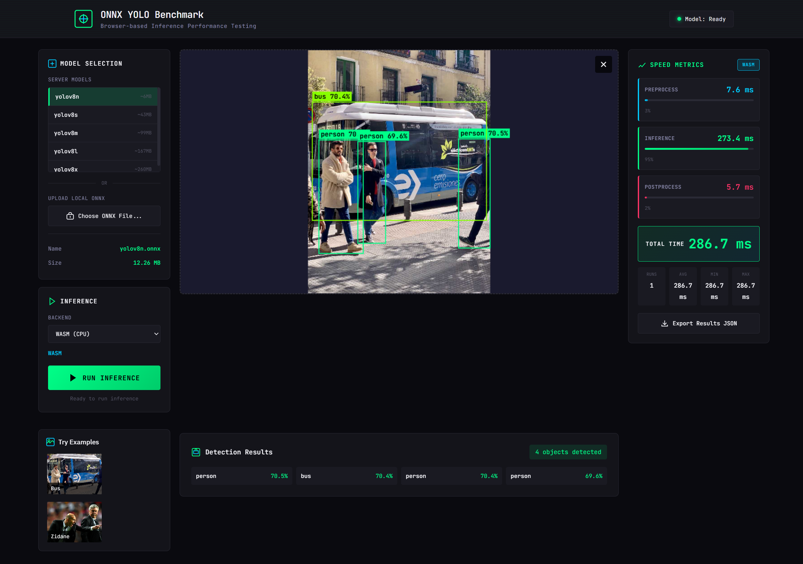

# Web YOLO Benchmark

Browser-based YOLOv8 inference benchmark using ONNX Runtime Web.



## Features

- Run YOLOv8 object detection directly in the browser
- Support for multiple backends: WASM (CPU), WebGPU, WebGL
- Multiple model sizes: YOLOv8n, YOLOv8s, YOLOv8m, YOLOv8l, YOLOv8x
- Real-time performance metrics: preprocessing, inference, postprocessing
- Responsive design for mobile devices

## Usage

### Local Development

```bash
npm install
npm run dev
```

Open https://localhost:5173 in your browser.

### Build for GitHub Pages

```bash
npm run build:github
```

The built files will be in the `dist` directory.

## Models

Models are hosted on [ModelScope/quick-infer-models](https://www.modelscope.cn/models/fanzhek/quick-infer-models) to ensure proper CORS support for browser downloads.

Default models:
- YOLOv8n (~12MB)
- YOLOv8s (~43MB)
- YOLOv8m (~99MB)
- YOLOv8l (~167MB)
- YOLOv8x (~260MB)

## Deploy Your Own Models

Edit `.env` or `.env.github`:

```
VITE_MODELSCOPE_REPO=your-username/your-model-repo
VITE_MODELS=[{"name":"your-model.onnx","size":"~50MB"}]
```

Upload ONNX models to your ModelScope repository.

## Browser Compatibility

| Backend | Chrome | Edge | Firefox | Safari |
|---------|--------|------|---------|--------|
| WASM    | ✓      | ✓    | ✓       | ✓      |
| WebGL   | ✓      | ✓    | ✓       | ✓      |
| WebGPU  | ✓      | ✓    | Partial | ✗      |

WebGPU provides the best performance but requires browser support.

[todo]
- add repo in the web foot
- yolov11\yolov26 support
- sam3 support 
